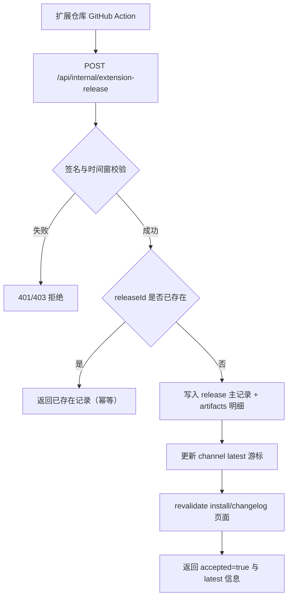

## Context

官网现有能力侧重用户鉴权、订阅与分享，不包含扩展发布元数据通路。
本变更关注网站侧发布接入：接收签名请求、幂等入库、更新渠道最新版本，以及让页面版本信息即时可见。

## Goals / Non-Goals

**Goals:**
- 提供可鉴权的内部发布同步接口，接收扩展仓库发送的发布 DTO。
- 保证幂等写入与渠道 latest 原子更新。
- 让安装页/更新页在发布后立即看到最新版本（无需手工改代码）。
- 与扩展仓库共享同一套 TS 类型与 DTO 定义。

**Non-Goals:**
- 不在本次变更中引入外部消息队列或事件总线。
- 不实现复杂发布审批流（仅接收可信自动化发布事件）。
- 不替代现有业务 RPC 体系（该接口定位为内部系统接口）。

## Data Contracts（先定义 TS 类型与 DTO）

```ts
export type ReleaseChannel = 'dev' | 'rc' | 'stable';

export type BrowserTarget = 'chrome' | 'firefox' | 'edge' | 'safari';

export interface ExtensionArtifactDTO {
  browser: BrowserTarget;
  fileName: string;
  downloadUrl: string;
  sha256: string;
  sizeBytes: number;
  contentType: 'application/zip';
}

export interface ExtensionReleaseSyncRequestDTO {
  schemaVersion: 1;
  sourceRepo: string;
  releaseId: string;
  channel: ReleaseChannel;
  version: string;
  tag: string | null;
  commitSha: string;
  commitRef: string;
  releasedAt: string;
  artifacts: ExtensionArtifactDTO[];
}

export interface ExtensionReleaseSyncResponseDTO {
  accepted: boolean;
  releaseRecordId: string;
  latest: {
    channel: ReleaseChannel;
    version: string;
    releasedAt: string;
  };
}

export interface ExtensionChannelLatestDTO {
  channel: ReleaseChannel;
  version: string;
  tag: string | null;
  releasedAt: string;
  artifacts: ExtensionArtifactDTO[];
}
```

### 内部接口 DTO 约束

- Endpoint: `POST /api/internal/extension-release`
- Headers:
  - `x-release-timestamp`
  - `x-release-signature` (`sha256=<hmac>`)
- 校验规则：
  - 时间窗建议 5 分钟（超时拒绝）
  - HMAC 校验失败返回 401
  - `releaseId` 幂等（重复请求返回同一记录结果）

## 流程图（Mermaid）



## Decisions

- 决策 1：发布同步使用独立内部路由（非用户态 RPC）。
  - 理由：调用方是 GitHub Action，不走用户会话；安全模型不同。

- 决策 2：使用 HMAC + 时间戳校验请求真实性，并要求 `releaseId` 幂等。
  - 理由：避免伪造与重放；避免重跑 workflow 造成重复写入。

- 决策 3：采用“主记录 + 明细 + latest 游标”三层数据模型。
  - 理由：既保留审计历史，也可 O(1) 读取渠道最新版本。

- 决策 4：写入成功后主动触发页面 revalidate。
  - 理由：满足“版本号立即同步更新”的产品要求。

## 数据模型草案

```ts
export interface ExtensionReleaseRecordEntity {
  id: string;
  sourceRepo: string;
  releaseId: string;
  channel: ReleaseChannel;
  version: string;
  tag: string | null;
  commitSha: string;
  commitRef: string;
  releasedAt: string;
  createdAt: string;
}

export interface ExtensionReleaseArtifactEntity {
  id: string;
  releaseRecordId: string;
  browser: BrowserTarget;
  fileName: string;
  downloadUrl: string;
  sha256: string;
  sizeBytes: number;
  contentType: 'application/zip';
}

export interface ExtensionChannelLatestEntity {
  channel: ReleaseChannel;
  releaseRecordId: string;
  version: string;
  updatedAt: string;
}
```

## Risks / Trade-offs

- 发布高峰下同步接口可能被重复调用。
  - 缓解：`releaseId` 唯一约束 + 幂等返回。
- revalidate 频繁触发可能增加渲染压力。
  - 缓解：仅在 latest 发生变更时触发。
- 内部密钥泄露会带来伪造发布风险。
  - 缓解：最小权限、定期轮换、异常告警。

## Migration Plan

1. 新增数据表与迁移（release/artifact/latest）。
2. 实现内部同步路由、签名校验与 service 幂等逻辑。
3. 提供 `getChannelLatest(channel)` 查询能力。
4. 安装页/更新页改为服务端读取 latest 数据。
5. 联调扩展仓库 dev 渠道发布；验证页面即时刷新。

## 部署准备（最后）

- 环境变量与密钥：
  - `RELEASE_SYNC_SECRET`（与扩展仓库 Action 一致）
  - 可选：`RELEASE_SYNC_ALLOWED_REPO`（限制来源仓库）
- 数据库准备：
  - 执行发布元数据表 migration
  - 为 `releaseId`、`channel`、`releasedAt` 添加必要索引
- 网络与访问控制：
  - 确保生产域名可被 GitHub Runner 访问
  - 如有 WAF，放行该内部接口路径并保留速率限制
- 运行与观测：
  - 添加同步成功率/失败率日志与告警
  - 预置重放与回滚手册（按 releaseId 重放、回退 latest 指针）
