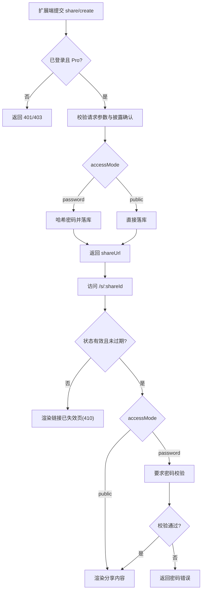
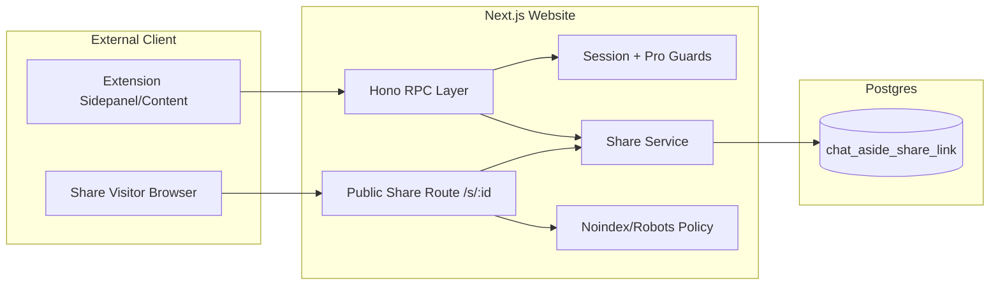

## Context

本仓库已具备会话认证（better-auth）、订阅（Pro）状态、RPC 路由框架与 Profile 页面，但尚无“分享链接”领域模型与访问链路。扩展端将新增 Share 入口后，后端需要提供：
- 受控分享创建（password/public + 过期策略）
- 公开访问渲染与密码校验
- 撤销/删除管理
- Pro 订阅门槛与统一错误语义

同时要满足安全与合规要求：密码不明文存储、链接禁止被搜索引擎收录、失效链接统一反馈。

## Goals / Non-Goals

**Goals:**
- 在网站端建立完整的分享域模型、RPC 与公开路由。
- 提供结构化快照渲染页（作者信息 + 品牌头 + 披露页脚）。
- 将分享能力纳入认证/订阅权限控制（仅 Pro）。
- 明确跨模块数据契约（DB schema / TS DTO / RPC payload）。
- 支持 Profile 管理面板中的复制、撤销、删除。

**Non-Goals:**
- 自动敏感信息识别与自动脱敏。
- 指定用户可见（ACL）模式。
- 已分享快照在线编辑。
- 搜索引擎可发现的公开分享（本次明确禁止索引）。

## Decisions

### 1. 采用“不可变快照 + 状态机”数据模型
- 决策：创建分享后仅允许状态流转（active -> revoked/expired），不允许修改快照正文。
- 原因：符合“分享瞬时状态”诉求，降低审计与一致性复杂度。
- 备选：可编辑分享，需版本管理与缓存失效策略，复杂度显著上升。

### 2. 访问控制模式：password 默认，public 可切换
- 决策：`password` 作为默认值；`public` 作为可选模式。
- 原因：安全默认更稳妥，同时保留低门槛分发。

### 3. 过期策略统一建模
- 决策：两种模式都支持 `permanent` / `expires_at`。
- 原因：与产品决策一致，减少分支规则。

### 4. 分享鉴权与订阅门槛纳入 RPC 中间层
- 决策：share 相关 RPC 统一执行 `requireSession + requirePro`。
- 原因：复用现有 auth/profile 能力，避免业务逻辑散落在 handler 中。

### 5. SEO 与失效语义
- 决策：
  - 分享页输出 `noindex,nofollow`（meta + X-Robots-Tag）
  - sitemap 排除 `/s/:id`
  - 撤销或过期统一渲染“链接已失效”，HTTP 语义用 `410 Gone`
- 原因：避免被收录并提供一致用户体验。

### 6. 密码安全
- 决策：密码使用 `scrypt` + 随机 salt 哈希保存；校验使用常量时间比较。
- 原因：满足基础安全标准并兼容当前 Node 运行环境。

### 7. 免责声明展示策略
- 决策：
  - Share Dialog 采用“双层免责声明”：常显短句 + 详细 tooltip。
  - 常显短句使用通用措辞（第三方聊天平台及其提供方），不硬编码平台名单。
  - 常显短句中的 `ChatKeep feature` 为独立可点击链接，跳转官网。
- 原因：同时满足品牌合规、可扩展性（平台数量变化）与用户可理解性。

## Data Contracts

### A. 数据库契约（Drizzle）
```ts
share_link {
  id: text (pk)
  owner_user_id: text (fk -> user.id)
  title: text
  source_chat_url: text
  source_platform: text
  access_mode: 'password' | 'public'
  expiry_mode: 'permanent' | 'expires_at'
  expires_at: timestamp nullable
  password_hash: text nullable
  password_salt: text nullable
  status: 'active' | 'revoked' | 'expired'
  snapshot_json: text // ShareChatSnapshotDTO serialized
  created_at: timestamp
  updated_at: timestamp
  revoked_at: timestamp nullable
}
```

### B. TS/DTO 契约
```ts
export type ShareAccessMode = 'password' | 'public';
export type ShareExpiryMode = 'permanent' | 'expires_at';
export type ShareStatus = 'active' | 'revoked' | 'expired';

export interface ShareChatSnapshotDTO {
  schemaVersion: 1;
  title: string;
  sourceUrl: string;
  platform: string;
  exportedAt: string;
  messages: Array<{ id: string; role: 'user' | 'assistant' | 'system'; content: string }>;
}

export interface ShareCreateRequestDTO {
  source: 'sidepanel' | 'content';
  chatUrl: string;
  accessMode: ShareAccessMode;
  expiryMode: ShareExpiryMode;
  expiresAt?: string;
  password?: string;
  disclosureConfirmed: true;
  snapshot: ShareChatSnapshotDTO;
}

export interface ShareCreateResponseDTO {
  shareId: string;
  shareUrl: string;
  accessMode: ShareAccessMode;
  expiresAt?: string;
}
```

### C. RPC/Route 契约
- `POST /api/rpc/share/create`（auth + pro）
- `POST /api/rpc/share/list`（auth + pro）
- `POST /api/rpc/share/revoke`（auth + pro）
- `POST /api/rpc/share/delete`（auth + pro）
- `POST /api/share/:shareId/verify-password`（public）
- `GET /s/:shareId`（public）

## 用户流程图



## 架构设计图



## 模块边界

- `src/server/db/schema.ts`
  - 仅定义 share 表结构与索引，不承载业务逻辑。
- `src/server/share/*`（新模块）
  - `share-service`：创建、列表、撤销、删除、过期判定、密码校验。
  - `share-repo`：持久化与查询。
  - `share-security`：密码哈希与验证、限流钩子。
- `src/server/rpc/app.ts`
  - 只做路由、鉴权中间件串联、DTO 校验与响应。
- `src/app/s/[shareId]/page.tsx`（新页面）
  - 只做展示与密码提交流程，不直接访问数据库。
- `src/app/profile/page.tsx`
  - 仅挂载分享管理 UI 与调用 RPC。

## Risks / Trade-offs

- [公开链接泄露] → 默认 password + 支持撤销 + 过期策略。
- [暴力破解 password] → 按 shareId + IP 进行限流与失败退避。
- [快照体积过大] → 设定 payload 上限并在创建前返回可读错误。
- [搜索引擎误抓取] → 三重防护（meta/header/sitemap）。
- [跨仓库 DTO 漂移] → 增加契约测试样例与 schemaVersion。

## Migration Plan

1. 增加 DB schema 与 migration，先发布但不开放入口。
2. 实现 share service 与 RPC 接口，增加权限与参数校验。
3. 上线 `/s/:shareId` 分享页、密码校验接口、失效页。
4. 在 `/profile` 加分享管理区并接入 RPC。
5. 更新定价与文案（Pro 可用）。
6. 灰度发布并监控：创建成功率、401/403 比例、密码校验失败率、410 命中率。

回滚策略：
- 关闭 share 入口与创建接口（feature flag 或路由短路）。
- 保留历史记录与访问路由，统一切换到失效页，避免数据破坏。

## Open Questions

- 指定到期时间是否限制最大跨度（例如最多 365 天）？
- Password 校验通过后的访问票据有效期是否需要可配置？
- 管理面板首版是否需要筛选（active/revoked/expired）？
